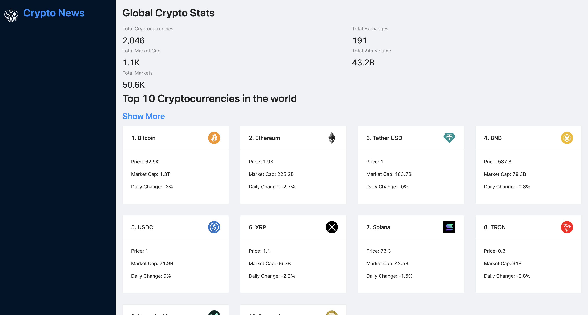
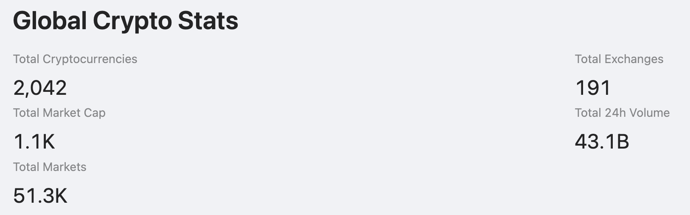
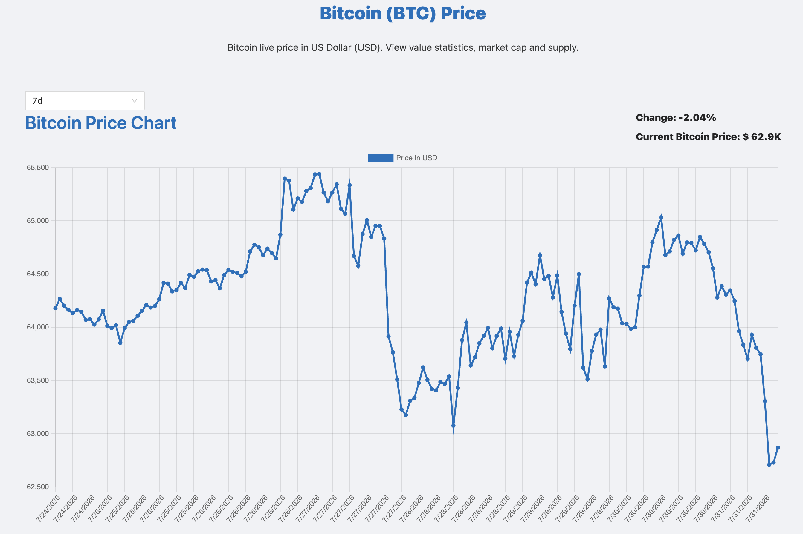
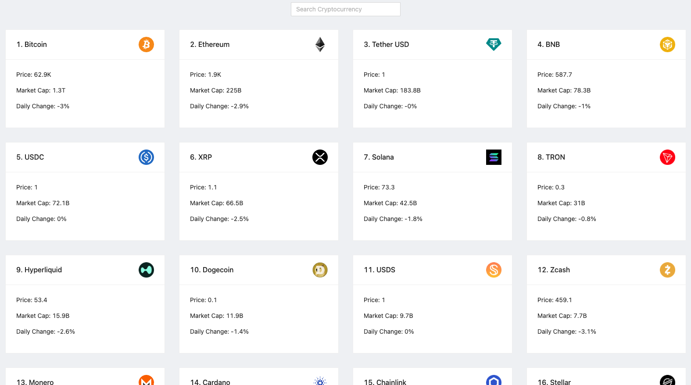

# Crypto News

A React web application that aggregates real-time cryptocurrency market data, price history, and news into a responsive dashboard.

---

## Overview

Crypto News was built to explore third-party API integration, asynchronous data management, and responsive interface design using React.

---

## Market Overview

The application displays live global cryptocurrency statistics alongside the highest-ranked cryptocurrencies, providing users with a quick snapshot of current market activity.

---

## Price Analytics

Users can explore historical cryptocurrency performance through interactive price charts and market statistics powered by live API data.

---

## Cryptocurrency Browser

Browse and search hundreds of cryptocurrencies while viewing key market metrics including price, market capitalization, and daily performance.

---

## Technologies

- React
- JavaScript
- Ant Design
- GraphQL
- Chart.js
- RapidAPI

---

## Technical Highlights

- Retrieved live cryptocurrency market data from third-party APIs.
- Managed asynchronous API requests and front-end application state.
- Built reusable React components for displaying market information.
- Created responsive data visualizations using Chart.js.
- Organized cryptocurrency data into searchable, interactive views.

---

## Deployment

Deployed using Netlify.

---

  

<!--
# Crypto News App

A React-based cryptocurrency dashboard created during Fullstack Academy.

## Overview

The project was designed to aggregate cryptocurrency news, pricing, and market data using third-party APIs. It included a responsive interface built with React, Ant Design, GraphQL, and Chart.js.

## Project Contributions

- Integrated third-party cryptocurrency data through RapidAPI.
- Built reusable React components for displaying market information.
- Created responsive interface elements using Ant Design.
- Used Chart.js to present cryptocurrency pricing and market data.
- Worked with asynchronous API requests and front-end application state.

## Technologies

React • JavaScript • Ant Design • GraphQL • Chart.js • RapidAPI

## Project Status

The original deployment and source files are no longer available in this repository.
-->
